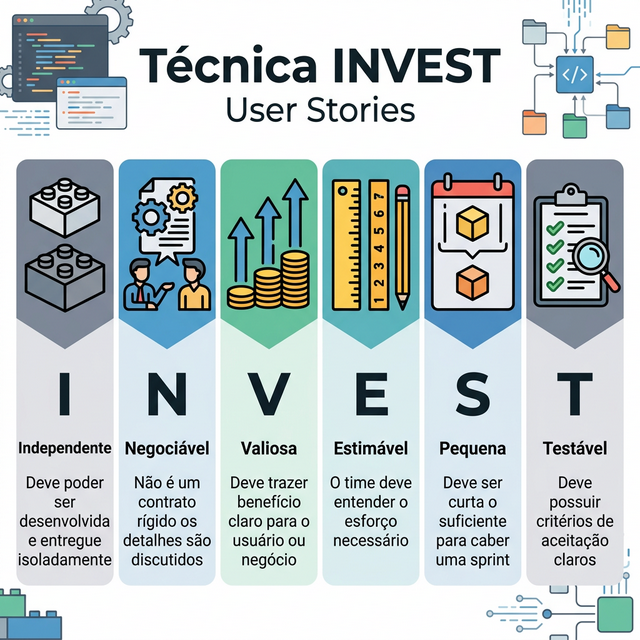
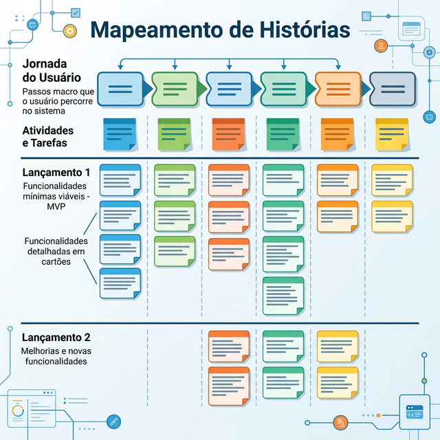
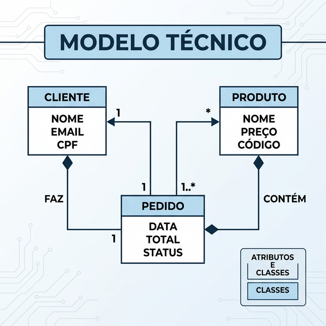

# Módulo 2: Requisitos Modernos

## Sumário
- [2.1 Técnicas de Levantamento](#21-técnicas-de-levantamento)
- [2.2 User Stories](#22-user-stories)
- [2.3 Critérios de Aceitação](#23-critérios-de-aceitação)
- [2.4 Story Mapping](#24-story-mapping)
- [2.5 Requisitos Não Funcionais](#25-requisitos-não-funcionais)
- [2.6 Modelo de Domínio Inicial](#26-modelo-de-domínio-inicial)
- [Referências](#referências)

## Introdução
Requisitos são a base de qualquer software. Em abordagens modernas/ágeis, saímos de documentos de requisitos de 500 páginas para uma comunicação constante e artefatos leves como User Stories e protótipos. O foco é em entendimento compartilhado, não apenas em "documentação de contrato".

## 2.1 Técnicas de Levantamento

Como descobrir o que o usuário realmente precisa? (Nem sempre ele sabe dizer!)

- **Entrevistas:** Conversas diretas com stakeholders.
- **Observação (Job Shadowing):** Ver o usuário trabalhando para identificar "dores" reais.
- **Prototipação:** Criar esboços rápidos (wireframes) para validar ideias.

## 2.2 User Stories

User Stories (Histórias de Usuário) são descrições simples de uma feature sob a perspectiva de quem deseja a nova capacidade.

**Formato Clássico:**
> "Como [PERFIL], eu quero [AÇÃO], para que [VALOR/BENEFÍCIO]."

**Exemplo:**
"Como cliente do banco, eu quero consultar meu saldo pelo app, para que eu não precise ir até a agência."

### Técnica INVEST
Uma boa User Story deve ser:
- **I**ndependent (Independente)
- **N**egotiable (Negociável)
- **V**aluable (Valiosa)
- **E**stimable (Estimável)
- **S**mall (Pequena)
- **T**estable (Testável)

**Exercício 2.2:** Qual dos itens abaixo **NÃO** faz parte do acrônimo INVEST?

- a) Independent
- b) Validated
- c) Negotiable
- d) Small

Ver Resposta

**Resposta:** b) Validated

**Explicação:** O "V" em INVEST significa **Valuable** (Valiosa).

## 2.3 Critérios de Aceitação

Detalham as condições que uma User Story deve satisfazer para ser aceita. Frequentemente escritos no formato **Gherkin (Given-When-Then)**.

**Exemplo:**
> **Cenário:** Saldo positivo
> **Dado** (Given) que tenho R$ 100 na conta
> **Quando** (When) solicito o saldo
> **Então** (Then) o sistema deve exibir "R$ 100,00"

## 2.4 Story Mapping

Técnica para visualizar a jornada do usuário e quebrar grandes requisitos (épicos) em histórias menores, organizando-as por prioridade de lançamento (Releases). Ajuda a não perder a "Big Picture".

## 2.5 Requisitos Não Funcionais (RNFs)

Se os Requisitos Funcionais dizem "o que" o sistema faz, os Não Funcionais dizem "como" o sistema se comporta.
Exemplos:
- **Performance:** "A página deve carregar em menos de 2s".
- **Segurança:** "Senhas devem ser encriptadas".
- **Escalabilidade:** "O sistema deve suportar 1000 usuários simultâneos".

## 2.6 Modelo de Domínio Inicial

Antes de codificar classes e banco de dados, desenhamos o Modelo de Domínio para entender as entidades do negócio e suas relações, *sem nos preocuparmos com tecnologia*.

Exemplo: Em um E-commerce, temos `Cliente`, `Pedido`, `Produto`. Um `Pedido` *tem* vários `Itens de Pedido`.

**Exercício 2.6:** O que é um Modelo de Domínio?

- a) Um diagrama do banco de dados físico.
- b) Um diagrama de classes detalhado com métodos e tipos de variáveis.
- c) Uma representação conceitual das entidades de negócio e seus relacionamentos.
- d) Um protótipo de tela.

Ver Resposta

**Resposta:** c) Uma representação conceitual das entidades de negócio e seus relacionamentos.

**Explicação:** O modelo de domínio foca na linguagem onipresente (Ubiquitous Language) e conceitos do negócio, ignorando detalhes de implementação como chaves primárias ou tabelas.

## Referências

[1] COHN, Mike. User Stories Applied: For Agile Software Development. Addison-Wesley, 2004.

[2] PATTON, Jeff. User Story Mapping: Discover the Whole Story, Build the Right Product. O'Reilly Media, 2014.

[3] SOMMERVILLE, Ian. Software Engineering. 10th Edition. Pearson, 2015.

---
[Próximo módulo →](../teoria/modulo_03_modelagem_e_documentacao.md)

[Voltar aos Links Rápidos](../README.md#links-rapidos)
