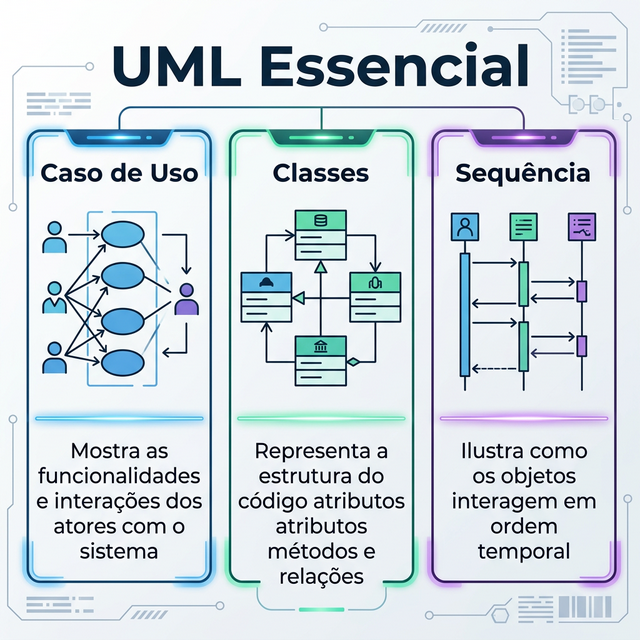
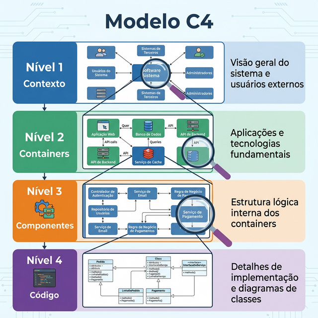
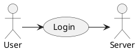

# Módulo 3: Modelagem e Documentação Leve

## Sumário
- [3.1 UML Essencial](#31-uml-essencial)
- [3.2 Boas práticas de modelagem](#32-boas-práticas-de-modelagem)
- [3.3 Diagrama C4](#33-diagrama-c4)
- [3.4 PlantUML e Draw.io](#34-plantuml-e-drawio)
- [3.5 Quando NÃO usar UML](#35-quando-não-usar-uml)
- [Referências](#referências)

## Introdução
Muitos desenvolvedores acham que documentação é perda de tempo ou "coisa de modelo cascata". Neste módulo, desmistificaremos isso. A documentação ágil é viva, focada em valor e comunicação, não em burocracia. "Documentação é como sexo: quando é boa, é ótima. Quando é ruim, é melhor que nada" (Dick Brandon) - mas no Agile, se for ruim ou inútil, jogamos fora!

## 3.1 UML Essencial

Unified Modeling Language (UML) é vasta, mas na prática usamos 20% dela para resolver 80% dos problemas.

### Diagrama de Casos de Uso
Mostra **quem** (ator) faz **o que** (funcionalidade) no sistema.
- Útil para: Visão geral do escopo funcional.

### Diagrama de Classes
Mostra a estrutura estática do sistema (classes, atributos, métodos e relacionamentos).
- Útil para: Discutir design de código e dependências.

### Diagrama de Sequência
Mostra como os objetos interagem ao longo do tempo para realizar um cenário.
- Útil para: Entender fluxos complexos e chamadas de API.

## 3.2 Boas práticas de modelagem

- **Modele para comunicar, não para documentar:** Se o diagrama não tira dúvidas de ninguém, ele é inútil.
- **Não modele tudo:** Foque nas partes complexas e nucleares do sistema.
- **Mantenha simples (KISS):** Um diagrama complexo demais mais confunde do que ajuda.
- **Coesão e Acoplamento:** Seus modelos devem refletir alta coesão (fazer uma coisa bem feita) e baixo acoplamento (depender pouco de outros módulos).

## 3.3 Diagrama C4

Criado por Simon Brown, o modelo C4 é o padrão moderno para arquitetura de software. Ele usa uma metáfora de "zoom" (como Google Maps).

1.  **Context (Nível 1):** O "big picture". Mostra seu sistema no centro e as interações com usuários e sistemas externos (Email, Payment Gateway).
2.  **Containers (Nível 2):** Mostra as aplicações executáveis (Web App, Mobile App, API, Database).
3.  **Components (Nível 3):** Detalhes dentro de um container (Controllers, Services, Repositories).
4.  **Code (Nível 4):** Diagramas de classes (geralmente não desenhamos este nível manualmente).

**Exercício 3.3:** Qual nível do C4 mostraria a interação entre sua API Backend e o Banco de Dados PostgreSQL?

- a) Context
- b) Containers
- c) Components
- d) Code

Ver Resposta

**Resposta:** b) Containers

**Explicação:** O nível de Containers mostra as unidades implantáveis e tecnologias principais (ex: API Java falando com DB Postgres).

## 3.4 PlantUML e Draw.io

### Diagramas como Código (PlantUML / Mermaid)
Escrever diagramas em texto permite versionamento (Git) e geração automática.

Exemplo PlantUML:

### Ferramentas Visuais (Draw.io / Excalidraw)
Ótimas para brainstorming rápido em reuniões.

## 3.5 Quando NÃO usar UML

- Para coisas óbvias (ex: getters/setters).
- Quando o código já é autoexplicativo ("The code is the documentation").
- Quando o documento vai "morrer" amanhã (use um quadro branco e tire foto).
- **Evite Overengineering:** Não crie documentação para o futuro hipotético. Documente o agora.

## Referências

[1] BROWN, Simon. Software Architecture for Developers. Leanpub, 2016.

[2] FOWLER, Martin. UML Distilled: A Brief Guide to the Standard Object Modeling Language. Addison-Wesley, 2003.

---
[Próximo módulo →](../teoria/modulo_04_arquitetura_moderna.md)

[Voltar aos Links Rápidos](../README.md#links-rapidos)
