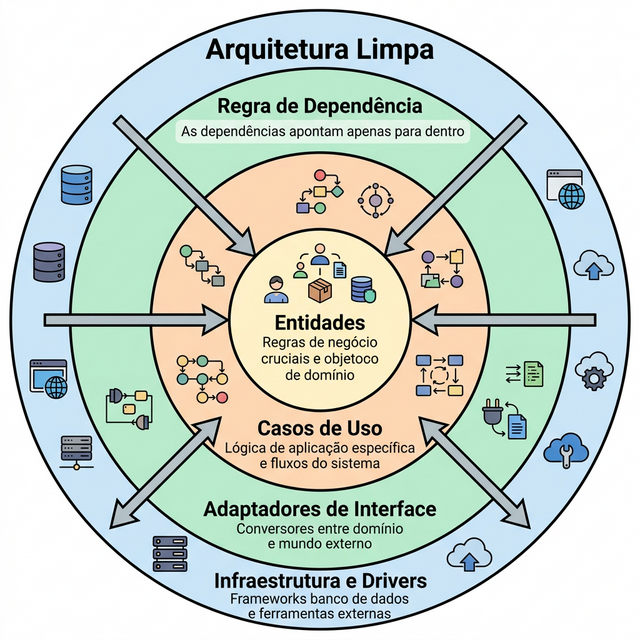
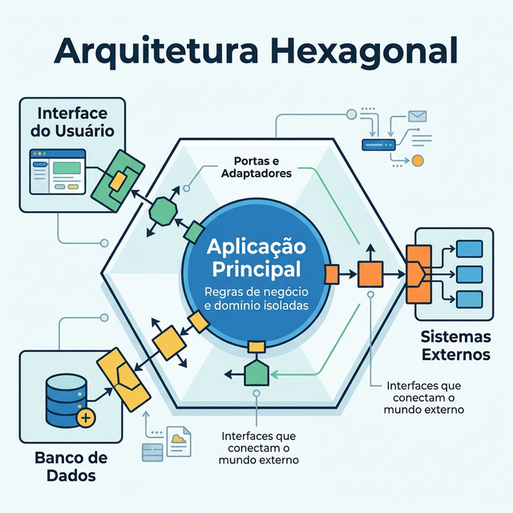

# Módulo 4: Arquitetura Moderna de Software

## Sumário
- [4.1 Arquitetura em Camadas](#41-arquitetura-em-camadas)
- [4.2 Clean Architecture](#42-clean-architecture)
- [4.3 Arquitetura Hexagonal](#43-arquitetura-hexagonal)
- [4.4 Introdução a DDD](#44-introdução-a-ddd)
- [4.5 Bounded Context](#45-bounded-context)
- [4.6 Monólito vs Microserviços](#46-monólito-vs-microserviços)
- [Referências](#referências)

## Introdução
Arquitetura é sobre decisões difíceis de mudar. "Se a arquitetura é boa, o software é fácil de manter; se é ruim, cada mudança é um pesadelo." Neste módulo, vamos do clássico ao moderno.

## 4.1 Arquitetura em Camadas

A forma mais tradicional de organizar código.
- **Apresentação (UI):** O que o usuário vê.
- **Negócio (Business/Domain):** As regras do jogo.
- **Dados (Data Access/Persistence):** Salvar no banco.

**Problema:** Frequentemente, a camada de Negócio depende da camada de Dados, tornando difícil testar regras sem um banco de dados real.

## 4.2 Clean Architecture

Proposta por "Uncle Bob" Martin. A regra de ouro é: **A dependência aponta para dentro.**
- As regras de negócio (Entidades/Use Cases) ficam no centro e NÃO dependem de nada externo (UI, Banco, Frameworks).
- A UI e o Banco de Dados são meros detalhes periféricos.

## 4.3 Arquitetura Hexagonal (Ports and Adapters)

Muito similar à Clean Architecture. O sistema possui "Portas" (Interfaces) para se comunicar com o mundo exterior.
- **Exemplo:** O sistema define uma porta `IRepository`. Um adaptador `PostgresRepository` implementa essa porta. O sistema não sabe que é Postgres, apenas que alguém implementou a porta.

## 4.4 Introdução a DDD (Domain-Driven Design)

DDD não é arquitetura, é uma abordagem de design focada em domínios complexos.

### Conceitos Táticos Principais:
- **Entidade:** Objeto com identidade única (ex: um Cliente com ID). Se mudar o nome, continua sendo o mesmo cliente.
- **Value Object:** Objeto definido por seus atributos, sem identidade (ex: um Endereço ou uma Data). Se mudar a rua, é outro endereço.
- **Agregado:** Um conjunto de objetos tratados como uma unidade de transação. Ex: Um Pedido e seus Itens. Você não salva um Item solto, você salva o Pedido (raiz do agregado).

**Exercício 4.4:** Um CPF (Cadastro de Pessoa Física) deve ser modelado como Entidade ou Value Object?

- a) Entidade, pois é único.
- b) Value Object, pois se eu mudar um dígito, é outro CPF, e ele não tem ciclo de vida próprio independente da pessoa.
- c) Entidade, pois tem métodos de validação.
- d) Nenhuma das anteriores.

Ver Resposta

**Resposta:** b) Value Object

**Explicação:** Embora o número seja identificador de uma Pessoa, o objeto "CPF" em si é imutável e definido pelo seu valor. Se mudar o número, é outro objeto.

## 4.5 Bounded Context (Contexto Delimitado)

Em sistemas grandes, a mesma palavra pode significar coisas diferentes.
- **Contexto de Vendas:** "Produto" tem preço, descrição e foto.
- **Contexto de Estoque:** "Produto" tem localização no galpão, peso e dimensões.
- **Contexto de Suporte:** "Produto" tem garantia e histórico de defeitos.

Em vez de criar uma classe `Produto` gigante (God Class), criamos modelos diferentes para cada contexto.

## 4.6 Monólito vs Microserviços

- **Monólito:** Tudo em um único executável/deploy. Simples de começar, difícil de escalar times grandes.
- **Microserviços:** Vários serviços pequenos se comunicando. Escala bem times e tecnologias, mas traz complexidade distribuída (latência, falhas de rede).

**Regra de ouro:** Comece com Monólito (modular). Só vá para Microserviços se tiver um bom motivo (escalabilidade, times independentes, etc.).

## Referências

[1] MARTIN, Robert C. Clean Architecture: A Craftsman's Guide to Software Structure and Design. Prentice Hall, 2017.

[2] EVANS, Eric. Domain-Driven Design: Tackling Complexity in the Heart of Software. Addison-Wesley, 2003.

[3] VERNON, Vaughn. Implementing Domain-Driven Design. Addison-Wesley, 2013.

---
[← Módulo anterior](../teoria/modulo_03_modelagem_e_documentacao.md)

[Próximo módulo →](../teoria/modulo_05_padroes_projeto_boas_praticas.md)

[Voltar aos Links Rápidos](../README.md#links-rapidos)
