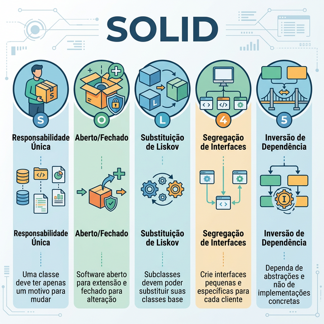
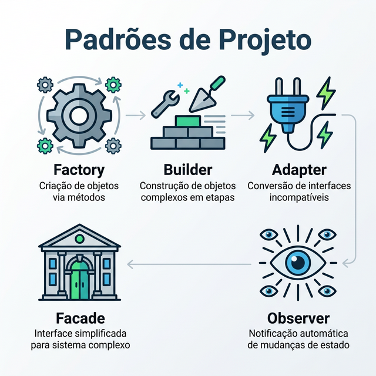

# Módulo 5: Projeto Orientado a Objetos Avançado

## Sumario
- [5.1 Principios SOLID](#51-principios-solid)
  - [5.1.1 S - Single Responsibility Principle (SRP)](#511-s---single-responsibility-principle-srp)
  - [5.1.2 O - Open/Closed Principle (OCP)](#512-o---openclosed-principle-ocp)
  - [5.1.3 L - Liskov Substitution Principle (LSP)](#513-l---liskov-substitution-principle-lsp)
  - [5.1.4 I - Interface Segregation Principle (ISP)](#514-i---interface-segregation-principle-isp)
  - [5.1.5 D - Dependency Inversion Principle (DIP)](#515-d---dependency-inversion-principle-dip)
  - [5.1.6 Resumo Visual dos Principios SOLID](#516-resumo-visual-dos-principios-solid)
- [5.2 GRASP](#52-grasp)
- [5.3 Padroes de Projeto Modernos](#53-padroes-de-projeto-modernos-gof)
  - [5.3.1 Factory Method](#531-factory-method-criacional)
  - [5.3.2 Builder](#532-builder-criacional)
  - [5.3.3 Adapter](#533-adapter-estrutural)
  - [5.3.4 Facade](#534-facade-estrutural)
  - [5.3.5 Observer](#535-observer-comportamental)
  - [5.3.6 Comparativo dos Padroes](#536-comparativo-dos-padroes)
- [5.4 Repository Pattern](#54-repository-pattern)
- [5.5 Anti-patterns](#55-anti-patterns)
- [Referencias](#referencias)

## Introdução
Saber Orientação a Objetos (Herança, Polimorfismo) é o básico. Para criar sistemas robustos, precisamos de diretrizes. SOLID e Design Patterns são o vocabulário comum dos engenheiros seniores.

## 5.1 Principios SOLID

Os principios SOLID foram introduzidos por Robert C. Martin (Uncle Bob) no inicio dos anos 2000 e representam cinco diretrizes fundamentais para o projeto orientado a objetos. Eles nao sao regras absolutas, mas heuristicas que, quando seguidas, levam a sistemas mais faceis de manter, testar e estender. A sigla SOLID e formada pelas iniciais de cada principio [1]:

| Letra | Principio | Resumo |
|-------|-----------|--------|
| **S** | Single Responsibility Principle | Uma classe, uma responsabilidade |
| **O** | Open/Closed Principle | Aberto para extensao, fechado para modificacao |
| **L** | Liskov Substitution Principle | Subtipos devem ser substituiveis por seus tipos base |
| **I** | Interface Segregation Principle | Interfaces pequenas e especificas |
| **D** | Dependency Inversion Principle | Dependa de abstracoes, nao de implementacoes |

---

### Por que usar SOLID?

Em projetos de pequeno porte, a falta de estruturação pode não ser um problema imediato. No entanto, à medida que o sistema cresce, a ausência desses princípios leva ao chamado **"Código Rígido"** e **"Frágil"**:
- **Rigidez:** Uma pequena mudança quebra diversas partes do sistema.
- **Fragilidade:** É difícil mudar o código porque o impacto é imprevisível.
- **Imobilidade:** Você não consegue reaproveitar partes do código em outros projetos.

Seguir o SOLID ajuda a criar um código mais coeso, com baixo acoplamento e altamente testável.

---


### 5.1.1 S - Single Responsibility Principle (SRP)

> "Uma classe deve ter um, e apenas um, motivo para mudar." - Robert C. Martin [1]

O SRP afirma que cada classe deve encapsular **uma unica responsabilidade**. Se uma classe tem mais de um motivo para ser alterada, ela esta fazendo coisas demais. Isso gera acoplamento desnecessario: uma mudanca em uma responsabilidade pode inadvertidamente quebrar outra.

**Como identificar violacoes do SRP:**
- A classe tem metodos que lidam com preocupacoes diferentes (ex: logica de negocio + formatacao de saida).
- Quando voce descreve o que a classe faz, usa a palavra "e" (ex: "calcula o salario **e** gera o relatorio **e** salva no banco").
- Mudancas em requisitos nao relacionados forcam alteracoes na mesma classe.

**Exemplo - ANTES de aplicar o SRP (violacao):**

```java
// PROBLEMA: A classe Pedido tem TRES responsabilidades:
// 1. Regras de negocio (calcular total)
// 2. Persistencia (salvar no banco)
// 3. Notificacao (enviar email)

public class Pedido {
    private List<ItemPedido> itens;
    private String emailCliente;

    public double calcularTotal() {
        double total = 0;
        for (ItemPedido item : itens) {
            total += item.getPreco() * item.getQuantidade();
        }
        return total;
    }

    public void salvarNoBanco() {
        Connection conn = DriverManager.getConnection("jdbc:mysql://localhost/loja");
        PreparedStatement stmt = conn.prepareStatement(
            "INSERT INTO pedidos (total) VALUES (?)"
        );
        stmt.setDouble(1, calcularTotal());
        stmt.executeUpdate();
    }

    public void enviarEmailConfirmacao() {
        EmailSender sender = new EmailSender();
        sender.send(emailCliente, "Pedido confirmado! Total: R$" + calcularTotal());
    }
}
```

**Problemas dessa abordagem:**
- Se a regra de calculo do total mudar, voce mexe na classe `Pedido`.
- Se o banco de dados mudar (ex: de MySQL para PostgreSQL), voce mexe na classe `Pedido`.
- Se o formato do email mudar, voce tambem mexe na classe `Pedido`.
- Tres equipes diferentes (negocios, infraestrutura, comunicacao) podem gerar conflitos na mesma classe.

**Exemplo - DEPOIS de aplicar o SRP (correto):**

```java
// Responsabilidade 1: Regras de negocio do pedido
public class Pedido {
    private List<ItemPedido> itens;
    private String emailCliente;

    public double calcularTotal() {
        double total = 0;
        for (ItemPedido item : itens) {
            total += item.getPreco() * item.getQuantidade();
        }
        return total;
    }

    public String getEmailCliente() {
        return emailCliente;
    }

    public List<ItemPedido> getItens() {
        return itens;
    }
}

// Responsabilidade 2: Persistencia
public class PedidoRepository {
    public void salvar(Pedido pedido) {
        Connection conn = DriverManager.getConnection("jdbc:mysql://localhost/loja");
        PreparedStatement stmt = conn.prepareStatement(
            "INSERT INTO pedidos (total) VALUES (?)"
        );
        stmt.setDouble(1, pedido.calcularTotal());
        stmt.executeUpdate();
    }
}

// Responsabilidade 3: Notificacao
public class NotificacaoPedidoService {
    public void enviarConfirmacao(Pedido pedido) {
        EmailSender sender = new EmailSender();
        sender.send(
            pedido.getEmailCliente(),
            "Pedido confirmado! Total: R$" + pedido.calcularTotal()
        );
    }
}
```

**Resultado:** Agora cada classe tem um unico motivo para mudar. Se o banco de dados mudar, so `PedidoRepository` e afetado. Se a regra de notificacao mudar, so `NotificacaoPedidoService` e alterado.

> [!TIP]
> **Dica Pro:** Se a sua classe precisa de mais de 10 segundos para ser explicada (ex: "Ela faz o cálculo de frete **E** a validação de estoque **E** o log"), ela provavelmente viola o SRP.


**Exercicio 5.1:** Qual e o principal beneficio de aplicar o Principio da Responsabilidade Unica (SRP)?

- a) Reduzir o numero total de classes no sistema
- b) Garantir que mudancas em uma responsabilidade nao afetem outras
- c) Eliminar a necessidade de interfaces
- d) Aumentar a performance do sistema

<details>
<summary>Ver Resposta</summary>

**Resposta:** b) Garantir que mudancas em uma responsabilidade nao afetem outras

**Explicacao:** O SRP isola responsabilidades em classes distintas, de modo que uma alteracao em uma preocupacao (ex: persistencia) nao afete outra (ex: regras de negocio). Isso reduz o risco de efeitos colaterais e facilita a manutencao. Note que aplicar o SRP geralmente *aumenta* o numero de classes, o que e positivo para a organizacao do codigo.
</details>

---

### 5.1.2 O - Open/Closed Principle (OCP)

> "Entidades de software devem ser abertas para extensao, mas fechadas para modificacao." - Bertrand Meyer [2]

O OCP estabelece que voce deve poder **adicionar novos comportamentos** a um sistema **sem alterar o codigo existente** que ja funciona. Isso e alcancado por meio de abstracoes (interfaces e classes abstratas), permitindo que novas implementacoes sejam criadas sem tocar nas classes ja testadas e em producao.

**Como identificar violacoes do OCP:**
- Blocos `if/else` ou `switch/case` que verificam o tipo de um objeto para decidir o comportamento.
- Toda vez que um novo requisito surge, voce precisa modificar uma classe existente em vez de criar uma nova.

**Exemplo - ANTES de aplicar o OCP (violacao):**

```java
// PROBLEMA: Para cada novo tipo de desconto, precisamos
// MODIFICAR esta classe adicionando mais "else if"

public class CalculadoraDesconto {

    public double calcular(Pedido pedido, String tipoDesconto) {
        double total = pedido.calcularTotal();

        if (tipoDesconto.equals("NATAL")) {
            return total * 0.15;
        } else if (tipoDesconto.equals("BLACK_FRIDAY")) {
            return total * 0.25;
        } else if (tipoDesconto.equals("CLIENTE_VIP")) {
            return total * 0.10;
        }
        // Se surgir um novo tipo de desconto (ex: DIA_DAS_MAES),
        // precisamos MODIFICAR este codigo, violando o OCP.
        return 0;
    }
}
```

**Problemas dessa abordagem:**
- Cada novo tipo de desconto exige modificacao da classe `CalculadoraDesconto`.
- O metodo cresce indefinidamente com novos `else if`.
- Risco de introduzir bugs no codigo existente ao cada alteracao.
- Dificuldade de testar cada estrategia de desconto isoladamente.

**Exemplo - DEPOIS de aplicar o OCP (correto):**

```java
// Abstracao: interface que define o contrato de desconto
public interface EstrategiaDesconto {
    double calcular(Pedido pedido);
}

// Implementacao 1: Desconto de Natal
public class DescontoNatal implements EstrategiaDesconto {
    @Override
    public double calcular(Pedido pedido) {
        return pedido.calcularTotal() * 0.15;
    }
}

// Implementacao 2: Desconto Black Friday
public class DescontoBlackFriday implements EstrategiaDesconto {
    @Override
    public double calcular(Pedido pedido) {
        return pedido.calcularTotal() * 0.25;
    }
}

// Implementacao 3: Desconto Cliente VIP
public class DescontoClienteVip implements EstrategiaDesconto {
    @Override
    public double calcular(Pedido pedido) {
        return pedido.calcularTotal() * 0.10;
    }
}

// Calculadora agora esta FECHADA para modificacao
// mas ABERTA para extensao (basta criar uma nova classe
// que implemente EstrategiaDesconto)
public class CalculadoraDesconto {
    public double calcular(Pedido pedido, EstrategiaDesconto estrategia) {
        return estrategia.calcular(pedido);
    }
}
```

**Resultado:** Para adicionar um novo desconto (ex: `DescontoDiaDasMaes`), basta criar uma nova classe que implemente `EstrategiaDesconto`. A classe `CalculadoraDesconto` **nunca mais precisa ser alterada**. Este padrao e conhecido como **Strategy Pattern** (Padrao Estrategia).

> [!TIP]
> **Dica Pro:** O uso excessivo de `switch/case` ou `if/else` complexos verificando enums ou tipos é um forte indício de violação de OCP. Considere usar Polimorfismo.


**Exercicio 5.1.1:** Considere o seguinte trecho de codigo:

```java
public double calcularFrete(String tipo) {
    if (tipo.equals("SEDEX")) return 25.0;
    else if (tipo.equals("PAC")) return 12.0;
    else return 8.0;
}
```

Qual principio SOLID esta sendo violado e qual seria a melhor abordagem para corrigi-lo?

- a) SRP - separar em classes diferentes por responsabilidade
- b) OCP - criar uma interface `CalculoFrete` com implementacoes para cada tipo
- c) LSP - criar subclasses substituiveis
- d) DIP - depender de abstracoes

<details>
<summary>Ver Resposta</summary>

**Resposta:** b) OCP - criar uma interface `CalculoFrete` com implementacoes para cada tipo

**Explicacao:** O codigo usa uma cadeia de `if/else` para decidir o comportamento com base em um tipo (String). Toda vez que um novo tipo de frete surgir (ex: "EXPRESSO"), sera necessario modificar este metodo. A solucao e criar uma interface `CalculoFrete` e implementacoes como `FreteSedex`, `FretePac`, etc. Assim, novos tipos de frete podem ser adicionados sem alterar o codigo existente.
</details>

---

### 5.1.3 L - Liskov Substitution Principle (LSP)

> "Se para cada objeto o1 do tipo S existe um objeto o2 do tipo T, tal que para todos os programas P definidos em termos de T, o comportamento de P nao muda quando o1 e substituido por o2, entao S e um subtipo de T." - Barbara Liskov [3]

Em termos mais simples: **subclasses devem poder substituir suas superclasses sem que o programa quebre ou se comporte de forma inesperada**. Se uma classe filha muda o comportamento esperado de um metodo da classe pai de maneira incompativel, a hierarquia de heranca esta errada.

A famosa frase resume bem: "Se parece um pato e grasna como um pato, mas precisa de baterias, voce tem a abstracao errada."

**Como identificar violacoes do LSP:**
- Uma subclasse lanca excecoes que a superclasse nao lanca.
- Uma subclasse ignora ou anula o comportamento de metodos herdados (ex: implementacao vazia).
- O codigo cliente precisa verificar o tipo concreto do objeto (usando `instanceof`) para decidir o que fazer.

**Exemplo - ANTES de aplicar o LSP (violacao):**

```java
// Classe base
public class Ave {
    public void voar() {
        System.out.println("Voando...");
    }

    public void comer() {
        System.out.println("Comendo...");
    }
}

// PROBLEMA: Pinguim e uma Ave, mas NAO voa!
// Lancar excecao viola o LSP porque o codigo cliente
// espera que toda Ave possa voar.
public class Pinguim extends Ave {
    @Override
    public void voar() {
        throw new UnsupportedOperationException("Pinguins nao voam!");
    }
}

// Codigo cliente que quebra:
public class BirdWatcher {
    public void observar(Ave ave) {
        ave.comer();  // OK
        ave.voar();   // ERRO se ave for Pinguim!
    }
}
```

**Problemas dessa abordagem:**
- O metodo `observar()` confia que toda `Ave` pode voar, mas `Pinguim` quebra essa expectativa.
- O programador seria forcado a verificar `if (ave instanceof Pinguim)` antes de chamar `voar()`, o que e fragil e nao escala.
- A hierarquia de classes esta modelada incorretamente.

**Exemplo - DEPOIS de aplicar o LSP (correto):**

```java
// Abstracao base: toda ave come
public abstract class Ave {
    public void comer() {
        System.out.println("Comendo...");
    }
}

// Interface separada para aves que voam
public interface Voadora {
    void voar();
}

// Pardal e uma ave que voa
public class Pardal extends Ave implements Voadora {
    @Override
    public void voar() {
        System.out.println("Pardal voando...");
    }
}

// Pinguim e uma ave que NAO voa - e isso nao e um problema!
public class Pinguim extends Ave {
    public void nadar() {
        System.out.println("Pinguim nadando...");
    }
}

// Codigo cliente seguro:
public class BirdWatcher {
    public void observar(Ave ave) {
        ave.comer(); // Toda ave come - seguro!
    }

    public void observarVoo(Voadora aveVoadora) {
        aveVoadora.voar(); // So recebe aves que realmente voam
    }
}
```

**Resultado:** Agora a hierarquia esta correta. `Pinguim` nao e forcado a implementar um metodo que nao faz sentido para ele. O codigo cliente que precisa de aves voadoras usa a interface `Voadora`, garantindo que so recebera objetos que realmente sabem voar.

> [!TIP]
> **Dica Pro:** Testes de unidade escritos para a Superclasse devem passar sem modificações quando executados contra qualquer objeto de uma Subclasse.


**Exercicio 5.1.2:** Em qual cenario o Principio de Substituicao de Liskov esta sendo violado?

- a) Uma classe `ContaBancaria` tem subclasses `ContaCorrente` e `ContaPoupanca` com implementacoes diferentes do metodo `calcularRendimento()`
- b) Uma classe `Retangulo` tem uma subclasse `Quadrado` que altera o comportamento de `setLargura()` para tambem modificar a altura
- c) Uma interface `Pagamento` tem implementacoes `PagamentoCartao` e `PagamentoPix`
- d) Uma classe abstrata `Veiculo` tem subclasses `Carro` e `Moto`

<details>
<summary>Ver Resposta</summary>

**Resposta:** b) Uma classe `Retangulo` tem uma subclasse `Quadrado` que altera o comportamento de `setLargura()` para tambem modificar a altura

**Explicacao:** Este e o exemplo classico de violacao do LSP. Um `Retangulo` permite definir largura e altura independentemente. Se `Quadrado` herda de `Retangulo` e modifica `setLargura()` para alterar tambem a altura (para manter os lados iguais), o comportamento esperado pelo codigo cliente e quebrado. Por exemplo: `ret.setLargura(5); ret.setAltura(10); assert ret.area() == 50` falharia para um `Quadrado` (area seria 100). A solucao e nao usar heranca nesse caso, ou criar abstracoes diferentes.
</details>

---

### 5.1.4 I - Interface Segregation Principle (ISP)

> "Clientes nao devem ser forcados a depender de interfaces que nao utilizam." - Robert C. Martin [1]

O ISP defende que **interfaces grandes e genericas devem ser divididas em interfaces menores e mais especificas**. Assim, as classes que implementam essas interfaces so precisam conhecer os metodos que realmente sao relevantes para elas.

**Como identificar violacoes do ISP:**
- Classes que implementam interfaces mas deixam metodos com corpo vazio ou lancam `UnsupportedOperationException`.
- Uma interface tem muitos metodos que raramente sao todos usados juntos.
- Mudancas em um metodo da interface forcam recompilacao/alteracao de classes que nem usam aquele metodo.

**Exemplo - ANTES de aplicar o ISP (violacao):**

```java
// PROBLEMA: Interface "gorda" que forca todas as classes
// a implementar metodos que podem nao fazer sentido para elas.

public interface Trabalhador {
    void trabalhar();
    void comer();
    void dormir();
    void participarDeReuniao();
    void programar();
    void gerenciarEquipe();
}

// Programador implementa tudo, mas nao gerencia equipe
public class Programador implements Trabalhador {
    @Override
    public void trabalhar() { System.out.println("Codificando..."); }

    @Override
    public void comer() { System.out.println("Almocando..."); }

    @Override
    public void dormir() { System.out.println("Dormindo..."); }

    @Override
    public void participarDeReuniao() { System.out.println("Em daily..."); }

    @Override
    public void programar() { System.out.println("Escrevendo codigo..."); }

    @Override
    public void gerenciarEquipe() {
        // NAO FAZ SENTIDO para um Programador!
        throw new UnsupportedOperationException("Programador nao gerencia equipe");
    }
}

// Gerente implementa tudo, mas nao programa
public class Gerente implements Trabalhador {
    @Override
    public void trabalhar() { System.out.println("Coordenando..."); }

    @Override
    public void comer() { System.out.println("Almocando..."); }

    @Override
    public void dormir() { System.out.println("Dormindo..."); }

    @Override
    public void participarDeReuniao() { System.out.println("Liderando reuniao..."); }

    @Override
    public void programar() {
        // NAO FAZ SENTIDO para um Gerente!
        throw new UnsupportedOperationException("Gerente nao programa");
    }

    @Override
    public void gerenciarEquipe() { System.out.println("Gerenciando..."); }
}
```

**Problemas dessa abordagem:**
- `Programador` e forcado a implementar `gerenciarEquipe()` (que nao faz sentido).
- `Gerente` e forcado a implementar `programar()` (que nao faz sentido).
- Se um novo metodo for adicionado a interface `Trabalhador`, todas as classes sao afetadas.

**Exemplo - DEPOIS de aplicar o ISP (correto):**

```java
// Interfaces segregadas: cada uma com responsabilidades especificas

public interface Trabalhador {
    void trabalhar();
}

public interface SerHumano {
    void comer();
    void dormir();
}

public interface Reunivel {
    void participarDeReuniao();
}

public interface Desenvolvedor {
    void programar();
}

public interface Lider {
    void gerenciarEquipe();
}

// Programador implementa SOMENTE o que faz sentido
public class Programador implements Trabalhador, SerHumano, Reunivel, Desenvolvedor {
    @Override
    public void trabalhar() { System.out.println("Codificando..."); }

    @Override
    public void comer() { System.out.println("Almocando..."); }

    @Override
    public void dormir() { System.out.println("Dormindo..."); }

    @Override
    public void participarDeReuniao() { System.out.println("Em daily..."); }

    @Override
    public void programar() { System.out.println("Escrevendo codigo..."); }
}

// Gerente implementa SOMENTE o que faz sentido
public class Gerente implements Trabalhador, SerHumano, Reunivel, Lider {
    @Override
    public void trabalhar() { System.out.println("Coordenando..."); }

    @Override
    public void comer() { System.out.println("Almocando..."); }

    @Override
    public void dormir() { System.out.println("Dormindo..."); }

    @Override
    public void participarDeReuniao() { System.out.println("Liderando reuniao..."); }

    @Override
    public void gerenciarEquipe() { System.out.println("Gerenciando..."); }
}
```

**Resultado:** Cada classe implementa apenas as interfaces relevantes para ela. Nenhum metodo fica com implementacao vazia ou lanca excecao. Se uma nova funcionalidade surgir (ex: `Mentor`), basta criar uma nova interface sem afetar as existentes.

**Exercicio 5.1.3:** Qual das alternativas abaixo e um sinal de violacao do Interface Segregation Principle?

- a) Uma interface com apenas dois metodos
- b) Uma classe que implementa uma interface e deixa metodos com corpo vazio
- c) Varias interfaces pequenas sendo implementadas por uma classe
- d) Uma classe que implementa todos os metodos de uma interface de forma funcional

<details>
<summary>Ver Resposta</summary>

**Resposta:** b) Uma classe que implementa uma interface e deixa metodos com corpo vazio

**Explicacao:** Quando uma classe e obrigada a implementar metodos que nao usa e os deixa vazios (ou lanca excecoes), isso indica que a interface e grande demais e contem responsabilidades que nao sao relevantes para aquela classe. A solucao e dividir a interface em interfaces menores e mais coesas. Varias interfaces pequenas sendo implementadas (opcao c) e justamente a *solucao* para o ISP, nao uma violacao.
</details>

---

### 5.1.5 D - Dependency Inversion Principle (DIP)

> "Modulos de alto nivel nao devem depender de modulos de baixo nivel. Ambos devem depender de abstracoes. Abstracoes nao devem depender de detalhes. Detalhes devem depender de abstracoes." - Robert C. Martin [1]

O DIP inverte a direcao tradicional de dependencia. Em vez de uma classe de alto nivel (regra de negocio) depender diretamente de uma classe de baixo nivel (banco de dados, API externa), ambas dependem de uma **interface (abstracao)** que fica entre elas. Isso permite trocar a implementacao concreta sem alterar a logica de negocio.

**Como identificar violacoes do DIP:**
- Classes de negocio instanciam diretamente classes de infraestrutura (ex: `new MySQLConnection()`).
- Mudancas em detalhes de implementacao (ex: trocar de MySQL para MongoDB) exigem alteracoes na logica de negocio.
- Testes unitarios sao dificeis porque nao e possivel substituir dependencias por mocks.

**Exemplo - ANTES de aplicar o DIP (violacao):**

```java
// Modulo de BAIXO nivel: implementacao concreta
public class MySQLPedidoDAO {
    public void salvar(Pedido pedido) {
        // Logica especifica de MySQL
        Connection conn = DriverManager.getConnection("jdbc:mysql://localhost/loja");
        PreparedStatement stmt = conn.prepareStatement(
            "INSERT INTO pedidos (total) VALUES (?)"
        );
        stmt.setDouble(1, pedido.calcularTotal());
        stmt.executeUpdate();
    }

    public Pedido buscarPorId(int id) {
        // Logica especifica de MySQL
        Connection conn = DriverManager.getConnection("jdbc:mysql://localhost/loja");
        // ... consulta e retorno
        return new Pedido();
    }
}

// Modulo de ALTO nivel: regra de negocio
// PROBLEMA: Depende DIRETAMENTE da implementacao MySQL
public class ProcessarPedidoService {
    private MySQLPedidoDAO pedidoDAO = new MySQLPedidoDAO(); // Dependencia concreta!

    public void processar(Pedido pedido) {
        if (pedido.calcularTotal() > 0) {
            pedidoDAO.salvar(pedido);  // Acoplado ao MySQL
        }
    }
}
```

**Problemas dessa abordagem:**
- `ProcessarPedidoService` esta acoplado diretamente a `MySQLPedidoDAO`.
- Se a empresa decidir migrar para MongoDB ou PostgreSQL, sera necessario alterar `ProcessarPedidoService`.
- E impossivel testar `ProcessarPedidoService` isoladamente (sem um banco MySQL real rodando).
- A classe de alto nivel (regra de negocio) depende da classe de baixo nivel (infraestrutura).

**Exemplo - DEPOIS de aplicar o DIP (correto):**

```java
// ABSTRACAO: Interface que define o contrato
public interface PedidoRepository {
    void salvar(Pedido pedido);
    Pedido buscarPorId(int id);
}

// Modulo de BAIXO nivel: implementacao MySQL
public class MySQLPedidoRepository implements PedidoRepository {
    @Override
    public void salvar(Pedido pedido) {
        Connection conn = DriverManager.getConnection("jdbc:mysql://localhost/loja");
        PreparedStatement stmt = conn.prepareStatement(
            "INSERT INTO pedidos (total) VALUES (?)"
        );
        stmt.setDouble(1, pedido.calcularTotal());
        stmt.executeUpdate();
    }

    @Override
    public Pedido buscarPorId(int id) {
        // Logica especifica de MySQL
        return new Pedido();
    }
}

// Modulo de BAIXO nivel: implementacao MongoDB (alternativa)
public class MongoDBPedidoRepository implements PedidoRepository {
    @Override
    public void salvar(Pedido pedido) {
        // Logica especifica de MongoDB
        MongoCollection collection = database.getCollection("pedidos");
        Document doc = new Document("total", pedido.calcularTotal());
        collection.insertOne(doc);
    }

    @Override
    public Pedido buscarPorId(int id) {
        // Logica especifica de MongoDB
        return new Pedido();
    }
}

// Modulo de ALTO nivel: regra de negocio
// Depende da ABSTRACAO (interface), nao da implementacao
public class ProcessarPedidoService {
    private PedidoRepository pedidoRepository; // Depende da interface!

    // Injecao de dependencia pelo construtor
    public ProcessarPedidoService(PedidoRepository pedidoRepository) {
        this.pedidoRepository = pedidoRepository;
    }

    public void processar(Pedido pedido) {
        if (pedido.calcularTotal() > 0) {
            pedidoRepository.salvar(pedido); // Funciona com qualquer implementacao!
        }
    }
}

// Uso:
// Para MySQL:
ProcessarPedidoService service = new ProcessarPedidoService(new MySQLPedidoRepository());
// Para MongoDB (troca SEM alterar ProcessarPedidoService):
ProcessarPedidoService service = new ProcessarPedidoService(new MongoDBPedidoRepository());
```

**Resultado:** Agora `ProcessarPedidoService` depende apenas da interface `PedidoRepository`. Podemos trocar a implementacao de banco de dados sem tocar na logica de negocio. Alem disso, testes unitarios podem usar uma implementacao fake (`PedidoRepositoryFake`) para testar a logica sem precisar de um banco real.

> [!TIP]
> **Dica Pro:** **Inversão de Dependência (DIP)** é um conceito arquitetural. **Injeção de Dependência (DI)** é uma técnica/padrão para implementar essa inversão. Não os confunda!


**Exercicio 5.1.4:** No exemplo abaixo, qual principio SOLID esta sendo violado?

```java
public class RelatorioVendas {
    private MySQLDatabase db = new MySQLDatabase();

    public void gerar() {
        List<Venda> vendas = db.buscarVendas();
        // ... gera relatorio
    }
}
```

- a) SRP - a classe tem muitas responsabilidades
- b) OCP - a classe nao esta aberta para extensao
- c) LSP - a classe nao pode ser substituida por subclasses
- d) DIP - a classe de alto nivel depende diretamente de uma implementacao concreta

<details>
<summary>Ver Resposta</summary>

**Resposta:** d) DIP - a classe de alto nivel depende diretamente de uma implementacao concreta

**Explicacao:** `RelatorioVendas` (modulo de alto nivel, logica de negocio) depende diretamente de `MySQLDatabase` (modulo de baixo nivel, implementacao concreta). Se o banco mudar para PostgreSQL, por exemplo, `RelatorioVendas` precisaria ser alterado. A solucao e criar uma interface `Database` ou `VendaRepository` e injetar a dependencia pelo construtor. Note que, em um cenario real, esse codigo tambem pode violar o SRP, mas a violacao mais evidente e do DIP.
</details>

---

### 5.1.6 Resumo Visual dos Principios SOLID

| Principio | Pergunta-chave | Se a resposta for "sim", ha violacao |
|-----------|---------------|--------------------------------------|
| **SRP** | Esta classe tem mais de um motivo para mudar? | Divida em classes menores |
| **OCP** | Preciso modificar codigo existente para adicionar funcionalidade? | Use interfaces/abstracoes |
| **LSP** | A subclasse quebra expectativas quando substitui a superclasse? | Revise a hierarquia de heranca |
| **ISP** | A classe e obrigada a implementar metodos que nao usa? | Divida a interface |
| **DIP** | A classe de negocio instancia diretamente classes de infraestrutura? | Injete dependencias via interface |



## 5.2 GRASP

General Responsibility Assignment Software Patterns. Princípios que ajudam a atribuir responsabilidades às classes e objetos.
- **Controller:** Quem deve tratar um evento de sistema? (Um Controlador, não a View).
- **Creator:** Quem deve criar uma instância de A? (Quem contém A, ou usa A).
- **High Cohesion:** Mantenha classes focadas.
- **Low Coupling:** Mantenha classes independentes.

## 5.3 Padroes de Projeto Modernos (GoF)

Os Padroes de Projeto (Design Patterns) foram catalogados por Erich Gamma, Richard Helm, Ralph Johnson e John Vlissides - conhecidos como "Gang of Four" (GoF) - no livro classico de 1994 [4]. Eles descreveram 23 padroes divididos em tres categorias:

| Categoria | Objetivo | Exemplos |
|-----------|----------|----------|
| **Criacionais** | Como os objetos sao criados | Factory, Builder, Singleton, Prototype |
| **Estruturais** | Como os objetos sao compostos | Adapter, Facade, Decorator, Composite |
| **Comportamentais** | Como os objetos interagem | Observer, Strategy, Command, State |

Nao e necessario decorar todos os 23. Foque nos que aparecem com mais frequencia no dia a dia da engenharia de software moderna. A seguir, estudaremos os 5 mais essenciais com exemplos praticos.

---

### 5.3.1 Factory Method (Criacional)

> "Defina uma interface para criar um objeto, mas deixe as subclasses decidirem qual classe instanciar." - GoF [4]

O Factory Method encapsula a logica de criacao de objetos, permitindo que o codigo cliente crie objetos sem precisar conhecer a classe concreta que sera instanciada. Isso e especialmente util quando a criacao depende de condicoes que podem mudar.

**Analogia:** Pense em uma pizzaria. Voce pede "uma pizza de calabresa" sem saber como ela e feita. A cozinha (factory) decide os ingredientes, o tempo de forno e a montagem. Voce so recebe o produto final.

**Exemplo - ANTES de aplicar o Factory (sem o padrao):**

```java
// PROBLEMA: O codigo cliente precisa conhecer TODAS as classes
// concretas e decidir qual instanciar usando if/else

public class SistemaNotificacao {

    public void enviar(String tipo, String mensagem, String destinatario) {

        if (tipo.equals("EMAIL")) {
            // Criacao direta - acoplamento com a classe concreta
            SmtpClient smtp = new SmtpClient("smtp.servidor.com", 587);
            smtp.autenticar("usuario", "senha");
            smtp.enviarEmail(destinatario, "Notificacao", mensagem);
            smtp.desconectar();

        } else if (tipo.equals("SMS")) {
            // Criacao direta - acoplamento com outra classe concreta
            TwilioApi twilio = new TwilioApi("API_KEY_123");
            twilio.enviarSms("+55" + destinatario, mensagem);

        } else if (tipo.equals("PUSH")) {
            // Criacao direta - acoplamento com mais uma classe concreta
            FirebaseClient firebase = new FirebaseClient();
            firebase.conectar("projeto-id");
            firebase.enviarPush(destinatario, mensagem);
        }
        // Novo canal (ex: WhatsApp)? Precisa MODIFICAR este metodo.
    }
}
```

**Problemas dessa abordagem:**
- O metodo `enviar()` conhece detalhes de implementacao de cada canal (SMTP, Twilio, Firebase).
- Cada novo canal de notificacao exige modificacao do metodo (viola tambem o OCP).
- Impossivel testar o envio de um canal isoladamente sem os outros.
- Logica de criacao e logica de uso estao misturadas.

**Exemplo - DEPOIS de aplicar o Factory (com o padrao):**

```java
// Interface do produto
public interface Notificacao {
    void enviar(String destinatario, String mensagem);
}

// Produto concreto 1: Email
public class NotificacaoEmail implements Notificacao {
    @Override
    public void enviar(String destinatario, String mensagem) {
        SmtpClient smtp = new SmtpClient("smtp.servidor.com", 587);
        smtp.autenticar("usuario", "senha");
        smtp.enviarEmail(destinatario, "Notificacao", mensagem);
        smtp.desconectar();
    }
}

// Produto concreto 2: SMS
public class NotificacaoSms implements Notificacao {
    @Override
    public void enviar(String destinatario, String mensagem) {
        TwilioApi twilio = new TwilioApi("API_KEY_123");
        twilio.enviarSms("+55" + destinatario, mensagem);
    }
}

// Produto concreto 3: Push
public class NotificacaoPush implements Notificacao {
    @Override
    public void enviar(String destinatario, String mensagem) {
        FirebaseClient firebase = new FirebaseClient();
        firebase.conectar("projeto-id");
        firebase.enviarPush(destinatario, mensagem);
    }
}

// FACTORY: Encapsula a logica de criacao
public class NotificacaoFactory {
    public static Notificacao criar(String tipo) {
        switch (tipo) {
            case "EMAIL": return new NotificacaoEmail();
            case "SMS":   return new NotificacaoSms();
            case "PUSH":  return new NotificacaoPush();
            default: throw new IllegalArgumentException("Tipo desconhecido: " + tipo);
        }
    }
}

// Codigo cliente: simples e desacoplado
public class SistemaNotificacao {
    public void enviar(String tipo, String mensagem, String destinatario) {
        Notificacao notificacao = NotificacaoFactory.criar(tipo);
        notificacao.enviar(destinatario, mensagem);
    }
}
```

**Resultado:** O codigo cliente (`SistemaNotificacao`) nao conhece mais as classes concretas. A logica de criacao esta isolada na `NotificacaoFactory`. Para adicionar um novo canal (ex: WhatsApp), basta criar `NotificacaoWhatsApp` e registrar na factory, sem alterar o sistema de envio.

**Exercicio 5.3:** Qual e a principal vantagem do padrao Factory Method?

- a) Aumentar a velocidade de criacao dos objetos
- b) Desacoplar o codigo cliente das classes concretas que ele utiliza
- c) Garantir que apenas uma instancia de cada classe exista
- d) Simplificar a interface de um subsistema complexo

<details>
<summary>Ver Resposta</summary>

**Resposta:** b) Desacoplar o codigo cliente das classes concretas que ele utiliza

**Explicacao:** O Factory Method encapsula a logica de instanciacao, permitindo que o codigo cliente trabalhe com interfaces/abstracoes sem conhecer as implementacoes concretas. A opcao (c) descreve o Singleton, e a opcao (d) descreve o Facade.
</details>

---

### 5.3.2 Builder (Criacional)

> "Separe a construcao de um objeto complexo da sua representacao, de forma que o mesmo processo de construcao possa criar diferentes representacoes." - GoF [4]

O Builder e usado quando um objeto possui muitos parametros opcionais ou quando sua construcao envolve varios passos. Em vez de ter construtores com 10+ parametros (conhecidos como "constructors telescopicos"), o Builder permite construir o objeto passo a passo de forma legivel.

**Analogia:** Pense em montar um hamburguer em uma lanchonete. Voce nao recebe todos os ingredientes de uma vez. Voce escolhe: "quero pao integral, carne dupla, sem cebola, com queijo cheddar". Cada escolha e um passo, e no final voce chama "monta!" para receber o produto.

**Exemplo - ANTES de aplicar o Builder (sem o padrao):**

```java
// PROBLEMA: Construtor "telescopico" - muitos parametros,
// dificil de ler, facil de errar a ordem

public class Relatorio {
    private String titulo;
    private String autor;
    private String conteudo;
    private String cabecalho;
    private String rodape;
    private boolean incluirGraficos;
    private boolean incluirTabelas;
    private String formatoSaida; // PDF, HTML, CSV
    private int margemSuperior;
    private int margemInferior;

    // Construtor com MUITOS parametros - dificil de usar
    public Relatorio(String titulo, String autor, String conteudo,
                     String cabecalho, String rodape,
                     boolean incluirGraficos, boolean incluirTabelas,
                     String formatoSaida, int margemSuperior,
                     int margemInferior) {
        this.titulo = titulo;
        this.autor = autor;
        this.conteudo = conteudo;
        this.cabecalho = cabecalho;
        this.rodape = rodape;
        this.incluirGraficos = incluirGraficos;
        this.incluirTabelas = incluirTabelas;
        this.formatoSaida = formatoSaida;
        this.margemSuperior = margemSuperior;
        this.margemInferior = margemInferior;
    }
}

// Uso: Qual parametro e qual? Facil confundir a ordem!
Relatorio r = new Relatorio(
    "Vendas Q1", "Maria", "Conteudo aqui...",
    "Cabecalho", "Rodape",
    true, false,   // O que e true? O que e false?
    "PDF", 20, 15  // 20 e margem de que? E 15?
);
```

**Problemas dessa abordagem:**
- Construtor com muitos parametros e dificil de ler e manter.
- Facil trocar a ordem dos parametros (ex: `margemSuperior` e `margemInferior`).
- Valores `true`/`false` isolados nao comunicam o significado.
- Para parametros opcionais, seria necessario criar multiplos construtores.

**Exemplo - DEPOIS de aplicar o Builder (com o padrao):**

```java
public class Relatorio {
    private String titulo;
    private String autor;
    private String conteudo;
    private String cabecalho;
    private String rodape;
    private boolean incluirGraficos;
    private boolean incluirTabelas;
    private String formatoSaida;
    private int margemSuperior;
    private int margemInferior;

    // Construtor privado - so o Builder pode criar
    private Relatorio() {}

    // Classe Builder interna
    public static class Builder {
        private Relatorio relatorio = new Relatorio();

        public Builder titulo(String titulo) {
            relatorio.titulo = titulo;
            return this; // Retorna o proprio Builder para encadear chamadas
        }

        public Builder autor(String autor) {
            relatorio.autor = autor;
            return this;
        }

        public Builder conteudo(String conteudo) {
            relatorio.conteudo = conteudo;
            return this;
        }

        public Builder cabecalho(String cabecalho) {
            relatorio.cabecalho = cabecalho;
            return this;
        }

        public Builder rodape(String rodape) {
            relatorio.rodape = rodape;
            return this;
        }

        public Builder comGraficos() {
            relatorio.incluirGraficos = true;
            return this;
        }

        public Builder comTabelas() {
            relatorio.incluirTabelas = true;
            return this;
        }

        public Builder formato(String formato) {
            relatorio.formatoSaida = formato;
            return this;
        }

        public Builder margens(int superior, int inferior) {
            relatorio.margemSuperior = superior;
            relatorio.margemInferior = inferior;
            return this;
        }

        public Relatorio build() {
            // Pode incluir validacoes aqui
            if (relatorio.titulo == null) {
                throw new IllegalStateException("Titulo e obrigatorio");
            }
            return relatorio;
        }
    }
}

// Uso: LEGIVEL, auto-documentado, dificil de errar
Relatorio relatorio = new Relatorio.Builder()
    .titulo("Vendas Q1")
    .autor("Maria")
    .conteudo("Conteudo aqui...")
    .cabecalho("Cabecalho da Empresa")
    .comGraficos()
    .formato("PDF")
    .margens(20, 15)
    .build();
```

**Resultado:** O codigo de criacao e auto-documentado. Cada parametro tem um nome claro. Parametros opcionais podem ser omitidos sem criar construtores adicionais. Validacoes podem ser feitas no metodo `build()`. Este padrao e muito utilizado em APIs modernas (ex: `StringBuilder`, `Stream.builder()` no Java, `HttpRequest.newBuilder()` no Java 11+).

**Exercicio 5.3.1:** Em qual cenario o padrao Builder e mais indicado?

- a) Quando ha apenas 2 parametros no construtor
- b) Quando o objeto tem muitos parametros opcionais e a construcao deve ser legivel
- c) Quando precisamos garantir que apenas uma instancia exista
- d) Quando queremos esconder um subsistema complexo

<details>
<summary>Ver Resposta</summary>

**Resposta:** b) Quando o objeto tem muitos parametros opcionais e a construcao deve ser legivel

**Explicacao:** O Builder brilha quando a criacao de um objeto envolve muitos parametros (especialmente opcionais), onde um construtor tradicional seria confuso. Ele torna o codigo auto-documentado e permite encadear chamadas de forma fluente. Para apenas 2 parametros (opcao a), um construtor simples e suficiente.
</details>

---

### 5.3.3 Adapter (Estrutural)

> "Converta a interface de uma classe em outra interface que os clientes esperam. O Adapter permite que classes com interfaces incompativeis trabalhem juntas." - GoF [4]

O Adapter funciona exatamente como um adaptador de tomada do mundo real: ele "traduz" uma interface incompativel para a interface esperada pelo sistema, sem alterar nenhuma das duas classes originais.

**Analogia:** Voce comprou um notebook nos EUA com plug de 3 pinos chatos. Sua tomada brasileira tem 3 pinos redondos. O adaptador de tomada nao muda o notebook nem a tomada - ele simplesmente traduz um formato para outro.

**Exemplo - ANTES de aplicar o Adapter (sem o padrao):**

```java
// Interface que nosso sistema usa
public interface ProcessadorPagamento {
    void cobrar(double valor, String cartao);
    boolean verificarStatus(String transacaoId);
}

// Implementacao interna que ja funciona
public class PagSeguroProcessor implements ProcessadorPagamento {
    @Override
    public void cobrar(double valor, String cartao) {
        System.out.println("PagSeguro: Cobrando R$" + valor);
    }

    @Override
    public boolean verificarStatus(String transacaoId) {
        return true;
    }
}

// PROBLEMA: Novo gateway de pagamento com interface DIFERENTE
// Nao podemos modificar esta classe (e uma biblioteca externa)
public class StripeApi {
    // Metodos com nomes e parametros DIFERENTES do esperado
    public void createCharge(int amountInCents, String cardToken) {
        System.out.println("Stripe: Charging $" + (amountInCents / 100.0));
    }

    public String getChargeStatus(String chargeId) {
        return "succeeded";
    }
}

// Como usar StripeApi onde o sistema espera ProcessadorPagamento?
// SEM o Adapter, seria necessario modificar todo o codigo cliente
// ou criar if/else para verificar qual gateway esta em uso.
```

**Problemas dessa abordagem:**
- `StripeApi` tem interface incompativel com `ProcessadorPagamento` (nomes de metodos diferentes, valor em centavos vs. reais).
- Nao podemos alterar `StripeApi` (e uma biblioteca de terceiros).
- Sem o Adapter, o codigo cliente precisaria de condicionais para lidar com cada gateway.

**Exemplo - DEPOIS de aplicar o Adapter (com o padrao):**

```java
// O Adapter "traduz" a interface do Stripe para a interface do nosso sistema
public class StripeAdapter implements ProcessadorPagamento {
    private StripeApi stripe;

    public StripeAdapter(StripeApi stripe) {
        this.stripe = stripe;
    }

    @Override
    public void cobrar(double valor, String cartao) {
        // Traduz: valor em reais -> valor em centavos
        int valorEmCentavos = (int) (valor * 100);
        stripe.createCharge(valorEmCentavos, cartao);
    }

    @Override
    public boolean verificarStatus(String transacaoId) {
        // Traduz: String status -> boolean
        String status = stripe.getChargeStatus(transacaoId);
        return "succeeded".equals(status);
    }
}

// Codigo cliente: funciona com QUALQUER gateway de forma transparente
public class LojaVirtual {
    private ProcessadorPagamento pagamento;

    public LojaVirtual(ProcessadorPagamento pagamento) {
        this.pagamento = pagamento;
    }

    public void finalizarCompra(double valor, String cartao) {
        pagamento.cobrar(valor, cartao);
    }
}

// Uso com PagSeguro (nativo):
LojaVirtual loja1 = new LojaVirtual(new PagSeguroProcessor());
loja1.finalizarCompra(150.00, "4111-1111-1111-1111");

// Uso com Stripe (via Adapter):
LojaVirtual loja2 = new LojaVirtual(new StripeAdapter(new StripeApi()));
loja2.finalizarCompra(150.00, "4111-1111-1111-1111");
```

**Resultado:** O `StripeAdapter` traduz a interface do Stripe para a interface esperada pelo sistema. A classe `LojaVirtual` nao sabe (e nem precisa saber) se esta usando PagSeguro ou Stripe. Nenhuma das classes originais foi modificada.

**Exercicio 5.3.2:** Uma empresa possui um sistema legado com a interface `RelatorioAntigo` e precisa integrar uma nova biblioteca de geracao de relatorios que usa a interface `ModernReportEngine`. Qual padrao e mais adequado?

- a) Factory - criar relatorios sem expor a logica
- b) Builder - construir relatorios passo a passo
- c) Adapter - traduzir a interface da nova biblioteca para a interface esperada
- d) Observer - notificar quando o relatorio estiver pronto

<details>
<summary>Ver Resposta</summary>

**Resposta:** c) Adapter - traduzir a interface da nova biblioteca para a interface esperada

**Explicacao:** O cenario descreve exatamente o problema que o Adapter resolve: duas interfaces incompativeis que precisam trabalhar juntas. O Adapter criaria uma classe que implementa `RelatorioAntigo` mas internamente delega as chamadas para `ModernReportEngine`, traduzindo parametros e retornos conforme necessario. Nenhuma das duas classes originais precisa ser modificada.
</details>

---

### 5.3.4 Facade (Estrutural)

> "Forneca uma interface unificada para um conjunto de interfaces em um subsistema. O Facade define uma interface de nivel mais alto que torna o subsistema mais facil de usar." - GoF [4]

O Facade simplifica a interacao com um sistema complexo, oferecendo uma "fachada" com metodos simples que internamente coordenam multiplas classes e operacoes. O cliente so precisa conhecer a fachada, e nao os detalhes internos.

**Analogia:** Quando voce liga o carro, voce gira a chave (ou aperta um botao). Internamente, o sistema de ignicao verifica a bateria, aciona o motor de arranque, injeta combustivel, gera a faísca e sincroniza tudo. Voce nao precisa saber disso - a chave e a "fachada".

**Exemplo - ANTES de aplicar o Facade (sem o padrao):**

```java
// PROBLEMA: O codigo cliente precisa conhecer e coordenar
// TODAS as classes internas do subsistema de pedido

public class CheckoutController {

    public void finalizarCompra(Carrinho carrinho, Cliente cliente) {
        // Passo 1: Validar estoque
        EstoqueService estoque = new EstoqueService();
        for (Item item : carrinho.getItens()) {
            if (!estoque.verificarDisponibilidade(item.getId(), item.getQtd())) {
                throw new RuntimeException("Item sem estoque: " + item.getNome());
            }
        }

        // Passo 2: Calcular frete
        FreteService frete = new FreteService();
        double valorFrete = frete.calcular(cliente.getCep(), carrinho.getPesoTotal());

        // Passo 3: Aplicar desconto
        DescontoService desconto = new DescontoService();
        double valorDesconto = desconto.calcular(cliente, carrinho.getTotal());

        // Passo 4: Processar pagamento
        PagamentoService pagamento = new PagamentoService();
        double totalFinal = carrinho.getTotal() + valorFrete - valorDesconto;
        pagamento.cobrar(cliente.getCartao(), totalFinal);

        // Passo 5: Atualizar estoque
        for (Item item : carrinho.getItens()) {
            estoque.reduzir(item.getId(), item.getQtd());
        }

        // Passo 6: Enviar confirmacao
        EmailService email = new EmailService();
        email.enviar(cliente.getEmail(), "Compra confirmada! Total: R$" + totalFinal);

        // Passo 7: Registrar no log
        LogService log = new LogService();
        log.registrar("Compra finalizada para " + cliente.getNome());
    }
}
```

**Problemas dessa abordagem:**
- `CheckoutController` conhece e coordena 6 servicos diferentes.
- Se a ordem dos passos mudar, ou se um novo passo for adicionado, o Controller e modificado.
- A mesma logica de checkout pode precisar ser replicada em outros pontos (API mobile, chatbot).
- O Controller mistura orquestracao com logica de apresentacao.

**Exemplo - DEPOIS de aplicar o Facade (com o padrao):**

```java
// FACADE: Interface simples que esconde a complexidade
public class CheckoutFacade {
    private EstoqueService estoque;
    private FreteService frete;
    private DescontoService desconto;
    private PagamentoService pagamento;
    private EmailService email;
    private LogService log;

    public CheckoutFacade() {
        this.estoque = new EstoqueService();
        this.frete = new FreteService();
        this.desconto = new DescontoService();
        this.pagamento = new PagamentoService();
        this.email = new EmailService();
        this.log = new LogService();
    }

    // Metodo unico e simples que esconde toda a complexidade
    public ResultadoCompra finalizarCompra(Carrinho carrinho, Cliente cliente) {
        validarEstoque(carrinho);
        double valorFrete = frete.calcular(cliente.getCep(), carrinho.getPesoTotal());
        double valorDesconto = desconto.calcular(cliente, carrinho.getTotal());
        double totalFinal = carrinho.getTotal() + valorFrete - valorDesconto;
        pagamento.cobrar(cliente.getCartao(), totalFinal);
        atualizarEstoque(carrinho);
        email.enviar(cliente.getEmail(), "Compra confirmada! Total: R$" + totalFinal);
        log.registrar("Compra finalizada para " + cliente.getNome());
        return new ResultadoCompra(totalFinal, valorFrete, valorDesconto);
    }

    private void validarEstoque(Carrinho carrinho) {
        for (Item item : carrinho.getItens()) {
            if (!estoque.verificarDisponibilidade(item.getId(), item.getQtd())) {
                throw new RuntimeException("Item sem estoque: " + item.getNome());
            }
        }
    }

    private void atualizarEstoque(Carrinho carrinho) {
        for (Item item : carrinho.getItens()) {
            estoque.reduzir(item.getId(), item.getQtd());
        }
    }
}

// Codigo cliente: SIMPLES e desacoplado dos subsistemas
public class CheckoutController {
    private CheckoutFacade checkout = new CheckoutFacade();

    public void finalizarCompra(Carrinho carrinho, Cliente cliente) {
        ResultadoCompra resultado = checkout.finalizarCompra(carrinho, cliente);
        System.out.println("Compra finalizada! Total: R$" + resultado.getTotal());
    }
}

// API Mobile tambem pode usar a mesma Facade:
public class CheckoutApiMobile {
    private CheckoutFacade checkout = new CheckoutFacade();

    public ResultadoCompra processar(Carrinho carrinho, Cliente cliente) {
        return checkout.finalizarCompra(carrinho, cliente);
    }
}
```

**Resultado:** O `CheckoutController` agora chama um unico metodo da facade. Toda a orquestracao interna esta encapsulada. Se um novo passo for adicionado (ex: emitir nota fiscal), so a `CheckoutFacade` e alterada. Multiplos clientes (web, mobile, chatbot) podem reutilizar a mesma facade.

**Exercicio 5.3.3:** Qual padrao e mais adequado quando voce precisa simplificar a interacao com um subsistema composto por muitas classes?

- a) Adapter - converter interfaces incompativeis
- b) Factory - criar objetos sem expor a logica
- c) Facade - fornecer uma interface unificada e simplificada
- d) Builder - construir objetos complexos passo a passo

<details>
<summary>Ver Resposta</summary>

**Resposta:** c) Facade - fornecer uma interface unificada e simplificada

**Explicacao:** O Facade e projetado especificamente para este cenario: simplificar a interacao com um subsistema complexo composto por muitas classes. Diferente do Adapter (que converte uma interface em outra), o Facade cria uma interface nova e simplificada que coordena multiplas classes internamente. O cliente nao precisa conhecer os detalhes do subsistema.
</details>

---

### 5.3.5 Observer (Comportamental)

> "Defina uma dependencia um-para-muitos entre objetos, de modo que quando um objeto muda de estado, todos os seus dependentes sao notificados e atualizados automaticamente." - GoF [4]

O Observer implementa um mecanismo de "assinatura de eventos". Um objeto (o **Subject** ou **Publisher**) mantem uma lista de observadores (os **Observers** ou **Subscribers**) e os notifica automaticamente quando algo relevante acontece. Este padrao e a base de sistemas reativos modernos, como o funcionamento interno de frameworks como React, Vue.js e Angular.

**Analogia:** Pense em um canal do YouTube. Voce se inscreve (subscribe) no canal. Quando o canal publica um novo video, todos os inscritos sao notificados automaticamente. Voce nao precisa ficar verificando o canal a cada minuto.

**Exemplo - ANTES de aplicar o Observer (sem o padrao):**

```java
// PROBLEMA: A classe Pedido precisa avisar DIRETAMENTE
// cada sistema interessado quando o status muda.
// Para cada novo sistema, precisa modificar a classe Pedido.

public class Pedido {
    private String status;
    private String emailCliente;
    private double total;

    public void alterarStatus(String novoStatus) {
        this.status = novoStatus;

        // Notificar email - acoplamento direto!
        EmailService email = new EmailService();
        email.enviar(emailCliente, "Status do pedido: " + novoStatus);

        // Notificar estoque - acoplamento direto!
        EstoqueService estoque = new EstoqueService();
        if (novoStatus.equals("CANCELADO")) {
            estoque.reverterReserva(this);
        }

        // Notificar dashboard - acoplamento direto!
        DashboardService dashboard = new DashboardService();
        dashboard.atualizarMetricas(novoStatus, total);

        // Notificar auditoria - acoplamento direto!
        AuditoriaService auditoria = new AuditoriaService();
        auditoria.registrar("Pedido mudou para: " + novoStatus);

        // Novo sistema precisa ser notificado?
        // Mais uma modificacao na classe Pedido...
    }
}
```

**Problemas dessa abordagem:**
- `Pedido` esta acoplado a 4 servicos diferentes (Email, Estoque, Dashboard, Auditoria).
- Cada novo sistema que precisa ser notificado exige alteracao na classe `Pedido`.
- A classe `Pedido` viola o SRP (regra de negocio + notificacao).
- Impossivel desativar notificacoes individuais sem alterar o codigo.

**Exemplo - DEPOIS de aplicar o Observer (com o padrao):**

```java
// Interface do Observer (quem observa)
public interface PedidoObserver {
    void aoMudarStatus(Pedido pedido, String novoStatus);
}

// Subject (quem e observado)
public class Pedido {
    private String status;
    private String emailCliente;
    private double total;
    private List<PedidoObserver> observers = new ArrayList<>();

    // Metodos para gerenciar observers
    public void adicionarObserver(PedidoObserver observer) {
        observers.add(observer);
    }

    public void removerObserver(PedidoObserver observer) {
        observers.remove(observer);
    }

    public void alterarStatus(String novoStatus) {
        this.status = novoStatus;
        notificarObservers(novoStatus); // Notifica TODOS os inscritos
    }

    private void notificarObservers(String novoStatus) {
        for (PedidoObserver observer : observers) {
            observer.aoMudarStatus(this, novoStatus);
        }
    }

    // Getters
    public String getEmailCliente() { return emailCliente; }
    public double getTotal() { return total; }
}

// Observer 1: Notificacao por email
public class EmailObserver implements PedidoObserver {
    @Override
    public void aoMudarStatus(Pedido pedido, String novoStatus) {
        EmailService email = new EmailService();
        email.enviar(pedido.getEmailCliente(), "Status: " + novoStatus);
    }
}

// Observer 2: Controle de estoque
public class EstoqueObserver implements PedidoObserver {
    @Override
    public void aoMudarStatus(Pedido pedido, String novoStatus) {
        if (novoStatus.equals("CANCELADO")) {
            EstoqueService estoque = new EstoqueService();
            estoque.reverterReserva(pedido);
        }
    }
}

// Observer 3: Painel de metricas
public class DashboardObserver implements PedidoObserver {
    @Override
    public void aoMudarStatus(Pedido pedido, String novoStatus) {
        DashboardService dashboard = new DashboardService();
        dashboard.atualizarMetricas(novoStatus, pedido.getTotal());
    }
}

// Observer 4: Auditoria
public class AuditoriaObserver implements PedidoObserver {
    @Override
    public void aoMudarStatus(Pedido pedido, String novoStatus) {
        AuditoriaService auditoria = new AuditoriaService();
        auditoria.registrar("Pedido mudou para: " + novoStatus);
    }
}

// Configuracao: registrar os observers
Pedido pedido = new Pedido();
pedido.adicionarObserver(new EmailObserver());
pedido.adicionarObserver(new EstoqueObserver());
pedido.adicionarObserver(new DashboardObserver());
pedido.adicionarObserver(new AuditoriaObserver());

// Quando o status mudar, TODOS sao notificados automaticamente
pedido.alterarStatus("ENVIADO");
// Resultado: Email enviado, estoque atualizado, dashboard atualizado, auditoria registrada
```

**Resultado:** `Pedido` nao conhece mais os servicos concretos. Ele apenas notifica seus observers. Para adicionar um novo sistema (ex: notificacao por SMS), basta criar `SmsObserver` e registrar com `adicionarObserver()` - sem alterar a classe `Pedido`. Observers podem ser adicionados e removidos em tempo de execucao.

**Exercicio 5.3.4:** No padrao Observer, o que acontece quando o Subject muda de estado?

- a) O Subject consulta cada Observer para saber se deve notifica-lo
- b) Todos os Observers registrados sao notificados automaticamente
- c) Apenas o primeiro Observer registrado e notificado
- d) O Subject aguarda uma solicitacao dos Observers para enviar a atualizacao

<details>
<summary>Ver Resposta</summary>

**Resposta:** b) Todos os Observers registrados sao notificados automaticamente

**Explicacao:** No padrao Observer, quando o Subject muda de estado, ele percorre sua lista de Observers registrados e chama o metodo de notificacao de cada um. Todos os inscritos recebem a atualizacao automaticamente, sem necessidade de consulta ou solicitacao. Este modelo e chamado de "push" - o Subject empurra a informacao para os Observers. E o mesmo conceito por tras dos EventListeners em JavaScript e dos sistemas reativos modernos.
</details>

---

### 5.3.6 Comparativo dos Padroes

| Padrao | Categoria | Quando usar | Problema que resolve |
|--------|-----------|-------------|---------------------|
| **Factory** | Criacional | Criacao de objetos depende de condicoes | Acoplamento entre cliente e classes concretas |
| **Builder** | Criacional | Objetos com muitos parametros opcionais | Construtores confusos e ilegíveis |
| **Adapter** | Estrutural | Integrar classes com interfaces incompativeis | Incompatibilidade entre interfaces |
| **Facade** | Estrutural | Simplificar acesso a subsistemas complexos | Complexidade excessiva para o cliente |
| **Observer** | Comportamental | Reagir a mudancas de estado | Acoplamento entre quem notifica e quem escuta |



## 5.4 Repository Pattern

Isola a lógica de acesso a dados da lógica de domínio. O Repositório simula uma coleção de objetos em memória.
- Métodos comuns: `add()`, `remove()`, `getById()`, `findByCriteria()`.
- **Não** deve conter regras de negócio (ex: "se saldo < 0"). Isso fica na Entidade ou Service.

## 5.5 Anti-patterns

O que NÃO fazer:
- **God Object (Classe Deus):** Uma classe que sabe tudo e faz tudo (ex: tem 2000 linhas).
- **Spaghetti Code:** Fluxo de controle confuso, muitos GOTOs ou exceptions usadas como controle de fluxo.
- **Golden Hammer:** "Para quem tem martelo, tudo é prego". Usar a mesma tecnologia/padrão para tudo.

## Referencias

[1] MARTIN, Robert C. Clean Architecture: A Craftsman's Guide to Software Structure and Design. Prentice Hall, 2017.

[2] MEYER, Bertrand. Object-Oriented Software Construction. Prentice Hall, 1997.

[3] LISKOV, Barbara; WING, Jeannette. A Behavioral Notion of Subtyping. ACM Transactions on Programming Languages and Systems, v. 16, n. 6, p. 1811-1841, 1994.

[4] GAMMA, Erich et al. Design Patterns: Elements of Reusable Object-Oriented Software. Addison-Wesley, 1994.

[5] LARMAN, Craig. Applying UML and Patterns. Prentice Hall, 2004.

[6] MARTIN, Robert C. Agile Software Development, Principles, Patterns, and Practices. Prentice Hall, 2002.

---
[← Módulo anterior](../teoria/modulo_04_arquitetura_moderna.md)

[Próximo módulo →](../teoria/modulo_06_implementacao_e_qualidade.md)

[Voltar aos Links Rápidos](../README.md#links-rapidos)
