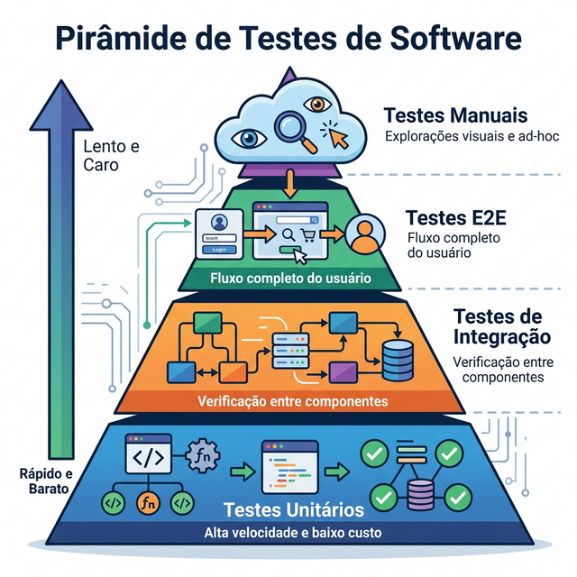
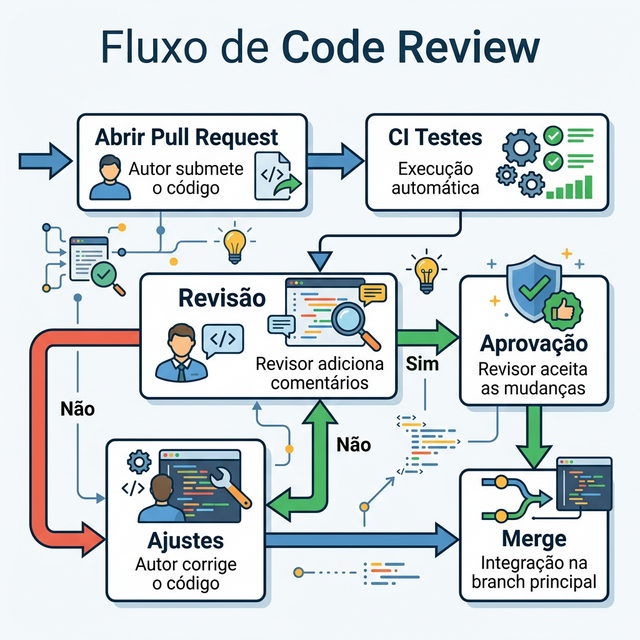

# Módulo 6: Implementação e Qualidade

## Sumário
- [6.1 Do modelo ao código](#61-do-modelo-ao-código)
- [6.2 Testes Unitários](#62-testes-unitários)
- [6.3 Testes de Integração](#63-testes-de-integração)
- [6.4 Testes End-to-End](#64-testes-end-to-end)
- [6.5 TDD](#65-tdd)
- [6.6 Code Review](#66-code-review)
- [Referências](#referências)

## Introdução
"Não basta funcionar, tem que provar que funciona." Neste módulo, focamos na tradução dos modelos para realidade e, principalmente, em **garantia de qualidade**.

## 6.1 Do modelo ao código

A transição do diagrama UML/DDD para código deve ser natural. Se você projetou classes com baixo acoplamento, a implementação será fluida.
- **Traceability (Rastreabilidade):** Você consegue olhar para o código e saber qual requisito ele atende?

## 6.2 Testes Unitários

Testam a menor unidade de código possível (geralmente uma função ou método) de forma **isolada**.
- **Ferramentas:** Jest (JS), JUnit (Java), PyTest (Python).
- **Mocking:** Para isolar a unidade, simulamos as dependências (Banco de dados, APIs) usando Mocks.

## 6.3 Testes de Integração

Verificam se as unidades funcionam bem **juntas**. Ex: A API salva corretamente no banco de dados de teste?
- São mais lentos que os unitários, mas garantem que as peças se encaixam.

## 6.4 Testes End-to-End (E2E)

Simulam o comportamento do usuário final, clicando em botões e navegando no navegador.
- **Ferramentas:** Cypress, Selenium, Playwright.
- Dica: Tenha poucos testes E2E (Pirâmide de Testes), pois são lentos e frágeis.

## 6.5 TDD (Test Driven Development)

Escrever o teste **antes** do código.
1.  **Red:** Escreva um teste que falha (pois a funcionalidade não existe).
2.  **Green:** Escreva o código mínimo para o teste passar.
3.  **Refactor:** Melhore o código mantendo o teste passando.

**Exercício 6.5:** Qual a ordem correta do ciclo TDD?

- a) Code - Test - Refactor
- b) Red - Refactor - Green
- c) Red - Green - Refactor
- d) Refactor - Red - Test

Ver Resposta

**Resposta:** c) Red - Green - Refactor

**Explicação:** O ciclo começa com a falha (Red), depois o sucesso (Green) e por fim a melhoria (Refactor).

## 6.6 Code Review

Revisão de código por pares. Não é para caçar bugs (testes fazem isso), é para:
- Compartilhar conhecimento.
- Garantir padrões de código.
- Discutir melhores soluções de design.
- **Dica:** Seja gentil. Critique o código, não a pessoa.

## Referências

[1] BECK, Kent. Test Driven Development: By Example. Addison-Wesley, 2002.

[2] FOWLER, Martin. Refactoring: Improving the Design of Existing Code. Addison-Wesley, 1999.

---
[← Módulo anterior](../teoria/modulo_05_padroes_projeto_boas_praticas.md)

[Próximo módulo →](../teoria/modulo_07_devops_e_entrega_continua.md)

[Voltar aos Links Rápidos](../README.md#links-rapidos)
