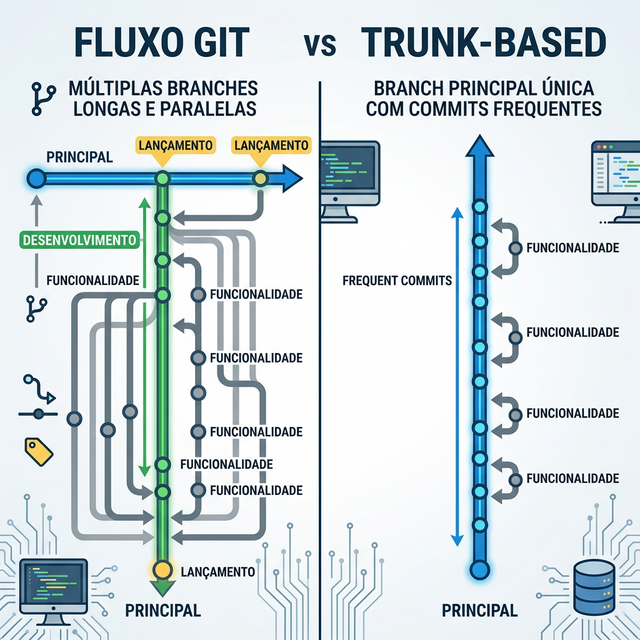
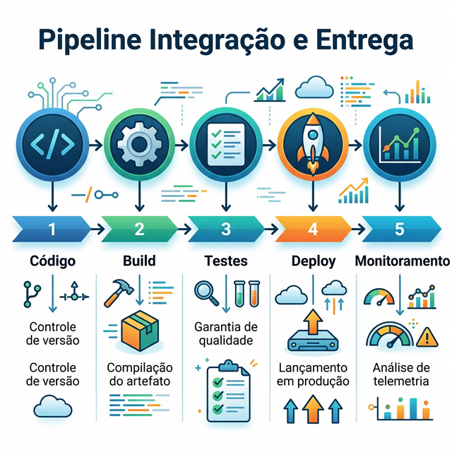

# Módulo 7: DevOps e Entrega Contínua

## Sumário
- [7.1 Versionamento com Git](#71-versionamento-com-git)
- [7.2 Conventional Commits](#72-conventional-commits)
- [7.3 CI/CD](#73-cicd)
- [Referências](#referências)

## Introdução
"Se dói, faça mais vezes". O DevOps une Desenvolvimento (Dev) e Operações (Ops) para que o deploy não seja um evento traumático, mas uma rotina segura e frequente.

## 7.1 Versionamento com Git

Git é a ferramenta essencial. Mas como usá-lo em equipe?

### Git Flow
Um modelo robusto com branches específicas:
- `main` (ou `master`): Código de produção.
- `develop`: Código de desenvolvimento.
- `feature/*`: Novas funcionalidades.
- `release/*`: Preparação para lançamento.
- `hotfix/*`: Correções urgentes em produção.

### Trunk-Based Development
Mais moderno e ágil. Todos commitam na `main` (trunk) frequentemente (talvez usando Feature Flags para esconder coisas incompletas). Evita o "Merge Hell".

## 7.2 Conventional Commits

Uma convenção internacional para dar significado às mensagens de commit, facilitando a automação e a leitura do histórico.

**Estrutura:** `tipo(escopo): descrição`

**Tipos comuns:**
- `feat`: Nova funcionalidade.
- `fix`: Correção de bug.
- `docs`: Alteração apenas na documentação.
- `style`: Formatação, ponto e vírgula faltando (não altera lógica).
- `refactor`: Refatoração de código (nem feat, nem fix).
- `test`: Adição ou correção de testes.
- `chore`: Atualização de tarefas de build, configurações, etc.

**Exemplos Práticos:**
- `feat(carrinho):` adiciona cálculo de frete
- `fix(api):` corrige erro 500 no endpoint de login
- `docs(readme):` atualiza instruções de instalação
- `style(global):` ajusta indentação do css
- `test(user):` adiciona teste unitário para cadastro
- `chore(deps):` atualiza versão do react

## 7.3 CI/CD (Continuous Integration / Continuous Delivery)

### CI: Integração Contínua
A prática de integrar código várias vezes ao dia.
- Todo commit dispara uma pipeline automatizada: Build -> Testes Unitários -> Linter.
- Se quebrar, o time para tudo para consertar.

### CD: Entrega Contínua (Delivery/Deployment)
- **Continuous Delivery:** O software está sempre pronto para ir para produção (um humano aperta o botão).
- **Continuous Deployment:** O software vai para produção automaticamente se passar nos testes (sem intervenção humana).

**Exercício 7.3:** O que acontece na fase de "Build" de uma pipeline de CI?

- a) O código é compilado/transpilado e empacotado.
- b) O código é enviado para o servidor do cliente.
- c) O gerente aprova a tarefa.
- d) Os testes E2E são executados.

Ver Resposta

**Resposta:** a) O código é compilado/transpilado e empacotado.

**Explicação:** Build transforma o código fonte em um artefato executável.

## Referências

[1] HUMBLE, Jez; FARLEY, David. Continuous Delivery. Addison-Wesley, 2010.

[2] KIM, Gene et al. The DevOps Handbook. IT Revolution Press, 2016.

---
[← Módulo anterior](../teoria/modulo_06_implementacao_e_qualidade.md)

[Voltar aos Links Rápidos](../README.md#links-rapidos)
